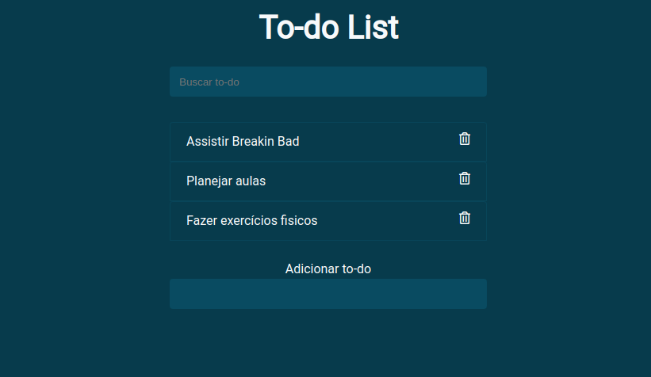

# TO-DO List (Lista de tarefa)

## Descrição:

Aplicativo web de list de tarefas. 
Acesse o [LINK](https://junioralvesbr.github.io/to-do-list/)

## Informações Técnicas:

Aplicativo criado com HTML, CSS e javaScript puro

### Tecnologias utilizadas:

  

## Autor: Junior Alves

